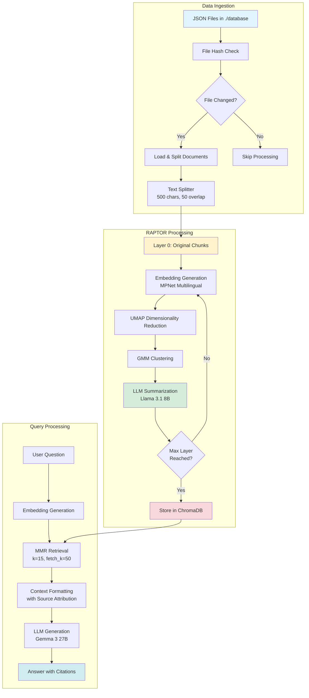

# RAPTOR-RAG: Recursive Abstractive Processing for Tree-Organized Retrieval

A production-ready implementation of the RAPTOR (Recursive Abstractive Processing for Tree-Organized Retrieval) algorithm for advanced Retrieval-Augmented Generation (RAG) systems. This system creates hierarchical document embeddings by recursively clustering and summarizing text chunks, enabling more contextually rich question-answering.

## 🎯 What is RAPTOR?

RAPTOR is an advanced RAG technique that builds a **multi-layer tree structure** of document representations:
- **Layer 0**: Original document chunks
- **Layer 1-3**: Progressively abstracted summaries created by clustering similar chunks

This hierarchical approach allows the system to retrieve both **detailed information** (from lower layers) and **high-level context** (from upper layers) simultaneously, significantly improving answer quality for complex queries.

## 🏗️ Architecture



## 🚀 Features

- ✅ **Hierarchical Indexing**: Multi-layer document representation (0-3 layers)
- ✅ **Intelligent Change Detection**: File hash-based synchronization to avoid redundant processing
- ✅ **Batch Processing**: Handles large datasets with 5000-document batches
- ✅ **Multilingual Support**: Uses multilingual embeddings (MPNet)
- ✅ **Source Attribution**: Automatic citation with filename in answers
- ✅ **MMR Retrieval**: Maximum Marginal Relevance for diverse, relevant results
- ✅ **Scalable**: ChromaDB server architecture for production use

## 📋 Requirements

```bash
pip install -r requirements.txt
```

### External Dependencies

1. **ChromaDB Server** (running on `localhost:8000`)
2. **Ollama** with models:
   - `gemma3:27b` (for answer generation)
   - `llama3.1:8b` (for summarization)
3. **Cloudflare Tunnel** (optional, for remote Ollama access)

## 🔧 Installation & Setup

### 1. Start ChromaDB Server

```bash
chroma run --host localhost --port 8000
```

### 2. Configure Settings

Edit the configuration variables in both files:

**croma_db_update.py:**
```python
CHROMA_HOST = "localhost"
CHROMA_PORT = 8000
DB_FOLDER = "./database"  # Your JSON files location
CLOUDFLARE_TUNNEL_URL = "your-tunnel-url"  # If using remote Ollama
```

**RAPTOR-RAG.py:**
```python
OLLAMA_MAIN_MODEL = "gemma3:27b"  # Your preferred LLM
```

### 3. Prepare Your Data

Place your JSON files in the `./database` folder. The system supports any JSON structure and will automatically process the content.

### 4. Build the Index

```bash
python croma_db_update.py
```

### 5. Query the System

```bash
python RAPTOR-RAG.py
```

Or integrate into your application:
```python
from RAPTOR_RAG import RaptorRAG

bot = RaptorRAG()
answer = bot.ask("Your question here")
```

## ⚠️ Important: Processing Time Expectations

**The initial indexing process is computationally intensive and time-consuming. This is NORMAL and EXPECTED.**

### Why Does It Take So Long?

1. **Embedding Generation**: Every document chunk must be embedded using a transformer model
2. **Clustering**: UMAP and GMM algorithms process large matrices
3. **LLM Summarization**: Each cluster is summarized using an LLM (the bottleneck)
4. **Hierarchical Processing**: The process repeats for 3 layers

### Typical Processing Times

Based on the provided logs:

| File | Chunks | Layer 1 | Layer 2 | Layer 3 | Total Time |
|------|--------|---------|---------|---------|------------|
| squad-tr (2.8K chunks) | 2,812 | 8m 12s | 2m 04s | 1m 04s | ~11 minutes |
| dev-v1.1 (10.7K chunks) | 10,761 | 15m 06s | 16m 10s | 17m 43s | ~49 minutes |
| train-v1.1 (67K chunks) | 67,016 | 40m 41s | 26m 41s | 29s | ~67 minutes |

**For a dataset with ~80K chunks, expect 2-3 hours of initial processing.**

### Good News

- ✅ This is a **ONE-TIME** process per file
- ✅ Subsequent runs detect unchanged files and skip them (< 1 second)
- ✅ Only modified/new files are reprocessed
- ✅ Query time is fast (7-22 seconds including LLM generation)

### Optimization Tips

1. **Use GPU**: Set `model_kwargs = {'device': 'cuda'}` for embeddings
2. **Faster LLM**: Use smaller models like `llama3.2:3b` for summarization
3. **Reduce Layers**: Set `max_layers = 2` instead of 3
4. **Process Overnight**: Schedule indexing during off-hours

## 📊 Performance Evaluation

### Test Query Results

| Query | Sources Found | Response Time | Answer Quality |
|-------|---------------|---------------|----------------|
| Notre Dame grotto location | 15 docs (Layer 0) | 7.69s | ✅ Correct with citation |
| Metric term less than Newton | 15 docs (Layer 0) | 7.16s | ✅ Correct (kilopond) |
| Norman cultural transformation (Turkish) | 15 docs (Layers 0-1) | 21.92s | ✅ Comprehensive multi-source |
| Train-v1.1 topics overview | 15 docs (Layers 0-2) | 13.97s | ✅ High-level synthesis |
| Super Bowl 50 outcomes | 15 docs (Layer 0) | 16.19s | ✅ Detailed with context |
| Why no Roman numeral "L"? | 15 docs (Layer 0) | 10.54s | ✅ Precise answer |

### Key Observations

✅ **Accurate Citations**: All answers include source filenames  
✅ **Multi-layer Retrieval**: System successfully retrieves from layers 0-2 based on query type  
✅ **Multilingual**: Handles both English and Turkish queries effectively  
✅ **Context Awareness**: Provides comprehensive answers by combining multiple sources  
✅ **Speed**: Sub-25 second responses including LLM generation  

## 📁 Project Structure

```
raptor-rag/
├── RAPTOR-RAG.py           # Query interface
├── croma_db_update.py      # Indexing and RAPTOR processing
├── database/               # Your JSON files
│   ├── train-v1.1.json
│   ├── dev-v1.1.json
│   └── squad-tr-dev-v1.0.0-excluded.json
└── README.md
```

## 🔍 How It Works

### Indexing Phase

1. **File Monitoring**: Calculates MD5 hash of each JSON file
2. **Change Detection**: Compares with stored hashes in ChromaDB metadata
3. **Document Splitting**: Breaks content into 500-character chunks with 50-char overlap
4. **Layer 0**: Stores original chunks with embeddings
5. **Clustering**: Uses UMAP + GMM to group similar chunks
6. **Summarization**: LLM generates summaries for each cluster
7. **Recursive Processing**: Repeats for layers 1-3, each time summarizing the previous layer

### Query Phase

1. **Embedding**: Convert question to vector
2. **Retrieval**: MMR search fetches 15 most relevant docs across all layers
3. **Context Formatting**: Organize sources with layer and filename metadata
4. **Generation**: LLM produces answer with citations
5. **Output**: Response with source attribution in `[filename]` format

## 🎛️ Configuration Options

### Embedding Model
```python
EMBEDDING_MODEL = HuggingFaceEmbeddings(
    model_name="sentence-transformers/paraphrase-multilingual-mpnet-base-v2"
)
```

### Retrieval Parameters
```python
self.retriever = self.vectorstore.as_retriever(
    search_type="mmr",              # Maximum Marginal Relevance
    search_kwargs={"k": 15, "fetch_k": 50}  # Return 15, consider 50
)
```

### RAPTOR Layers
```python
max_layers = 3  # Adjust in croma_db_update.py
```

### Chunk Size
```python
chunk_size=500,      # Characters per chunk
chunk_overlap=50     # Overlap for context preservation
```


